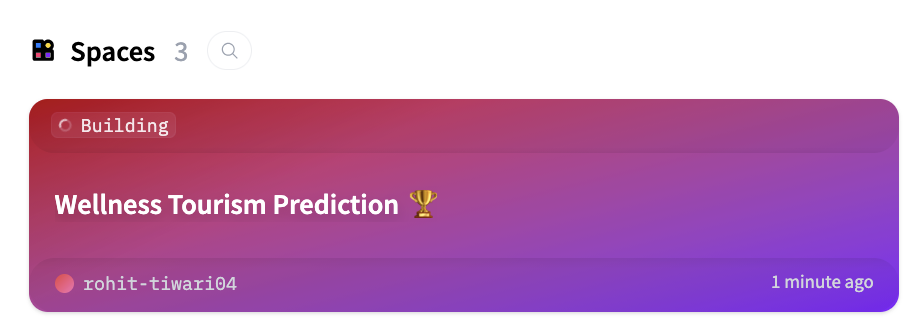
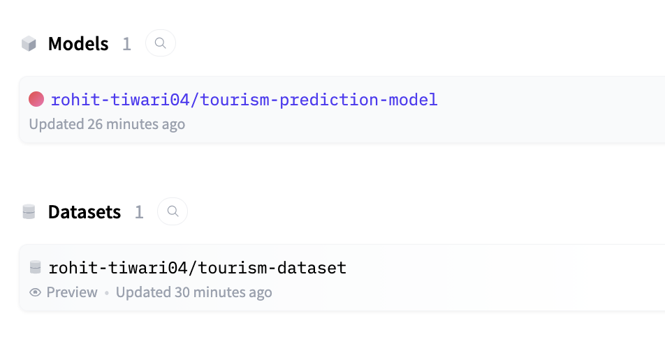
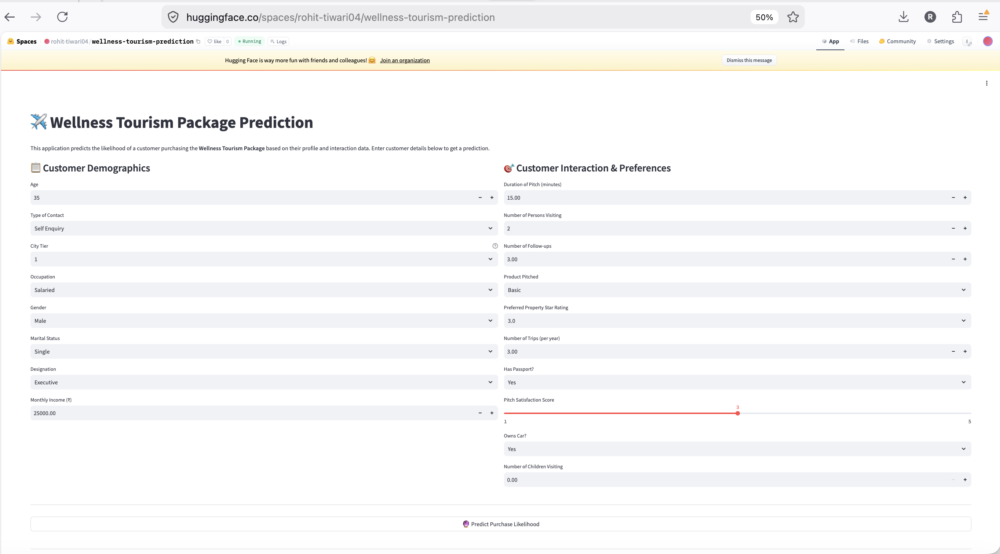

# 🧘 Wellness Tourism Package Prediction — MLOps Pipeline

An end-to-end MLOps pipeline built to predict whether a customer is likely to purchase the newly launched **Wellness Tourism Package**. The pipeline automates data registration, preprocessing, model training, experiment tracking, and deployment using **GitHub Actions**, **MLflow**, and the **Hugging Face Hub**.

---

## 🎯 Business Objective

Manually identifying potential buyers for new travel packages is slow, inconsistent, and error-prone. This project replaces that manual process with a predictive model that scores customers on their likelihood to purchase the Wellness Tourism Package *before* the sales team reaches out — enabling more efficient, data-driven targeting.

---

## 🏗️ Architecture

The pipeline is orchestrated as a 4-stage GitHub Actions workflow (`.github/workflows/pipeline.yml`), triggered on every push to `main`:

```
register-dataset  →  data-prep  →  model-training  →  deploy-hosting
```

| Stage | Script | What it does |
|---|---|---|
| **1. Register Dataset** | `model_building/data_register.py` | Uploads the raw dataset to a Hugging Face **Dataset repo** (creates the repo if it doesn't exist) |
| **2. Data Preparation** | `model_building/prep.py` | Loads raw data from Hugging Face, cleans it, encodes categorical features, splits into train/test sets, and pushes the processed CSVs back to the Dataset repo |
| **3. Model Training** | `model_building/train.py` | Loads the processed data, trains an **XGBoost classifier** with `GridSearchCV`, logs all runs/metrics/params to **MLflow**, and uploads the best model to a Hugging Face **Model repo** |
| **4. Deploy Hosting** | `hosting/hosting.py` | Packages the Streamlit inference app (`deployment/app.py` + `Dockerfile`) and pushes it to a Hugging Face **Space** for live predictions |

Each stage runs in its own GitHub Actions job and depends on the successful completion of the previous one (`needs:`), ensuring the pipeline fails fast if any upstream step breaks.

---

## 📊 Data

- **Source dataset:** [`rohit-tiwari04/tourism-dataset`](https://huggingface.co/datasets/rohit-tiwari04/tourism-dataset) (Hugging Face Hub)
- **Target variable:** `ProdTaken` (1 = purchased the package, 0 = did not)
- Raw features cover customer demographics (age, gender, income, occupation), and sales-interaction data (pitch duration, number of follow-ups, satisfaction score, product pitched, etc.)
- Preprocessing handles missing values (median/mode imputation), fixes data-quality issues (e.g. `"Fe Male"` → `"Female"`), drops the `CustomerID` identifier, and label-encodes categorical columns before a stratified 80/20 train-test split.

---

## 🤖 Model

- **Algorithm:** XGBoost Classifier, tuned via `GridSearchCV` (3-fold CV) over `n_estimators`, `max_depth`, `learning_rate`, `subsample`, `colsample_bytree`, and `scale_pos_weight`
- **Preprocessing:** `StandardScaler` applied to all numeric features inside an sklearn `Pipeline`
- **Optimization metric:** ROC-AUC
- **Tracked metrics:** Accuracy, Precision, Recall, F1-score, ROC-AUC (train & test), plus full classification report and confusion matrix
- **Experiment tracking:** All runs, hyperparameters, and metrics are logged to **MLflow**
- **Model registry:** Best model is serialized with `joblib` and pushed to [`rohit-tiwari04/tourism-prediction-model`](https://huggingface.co/rohit-tiwari04/tourism-prediction-model) on the Hugging Face Hub

---

## 🚀 Live Demo

The trained model is served through a **Streamlit** app, containerized with Docker, and deployed as a Hugging Face Space:

👉 🚀 **[Try the live app](https://huggingface.co/spaces/rohit-tiwari04/wellness-tourism-prediction)**

Enter a customer's demographic and interaction details to get an instant purchase-likelihood prediction with confidence scores.

---

## 📁 Repository Structure

```
Tourism_Project/
├── .github/
│   └── workflows/
│       └── pipeline.yml          # GitHub Actions CI/CD pipeline definition
├── tourism_project/
│   ├── data/                     # Raw dataset
│   ├── model_building/
│   │   ├── data_register.py      # Stage 1: register raw data on HF Hub
│   │   ├── prep.py                # Stage 2: clean, encode, split data
│   │   └── train.py               # Stage 3: train & register model
│   ├── deployment/
│   │   ├── app.py                 # Streamlit inference app
│   │   └── Dockerfile             # Container spec for the HF Space
│   ├── hosting/
│   │   └── hosting.py             # Stage 4: push app to HF Space
│   └── requirements.txt
└── README.md
```

---

## ⚙️ Tech Stack

- **CI/CD:** GitHub Actions
- **ML:** scikit-learn, XGBoost
- **Experiment tracking:** MLflow
- **Model & data registry / hosting:** Hugging Face Hub (Datasets, Models, Spaces)
- **Serving:** Streamlit + Docker

---

## 🔐 Setup Notes

The pipeline authenticates to Hugging Face using a GitHub Actions secret:

| Secret | Purpose |
|---|---|
| `HF_TOKEN` | Write-scoped Hugging Face access token, used to create/update the Dataset, Model, and Space repos |

Set this under **Settings → Secrets and variables → Actions** in the GitHub repo before running the workflow.

> **Note:** Hosting Docker/Gradio Spaces on Hugging Face's CPU Basic tier requires a paid (PRO) plan — Static Spaces remain free. Make sure the account behind `HF_TOKEN` has the appropriate plan for the `deploy-hosting` stage to succeed.

---

## 📈 Output



